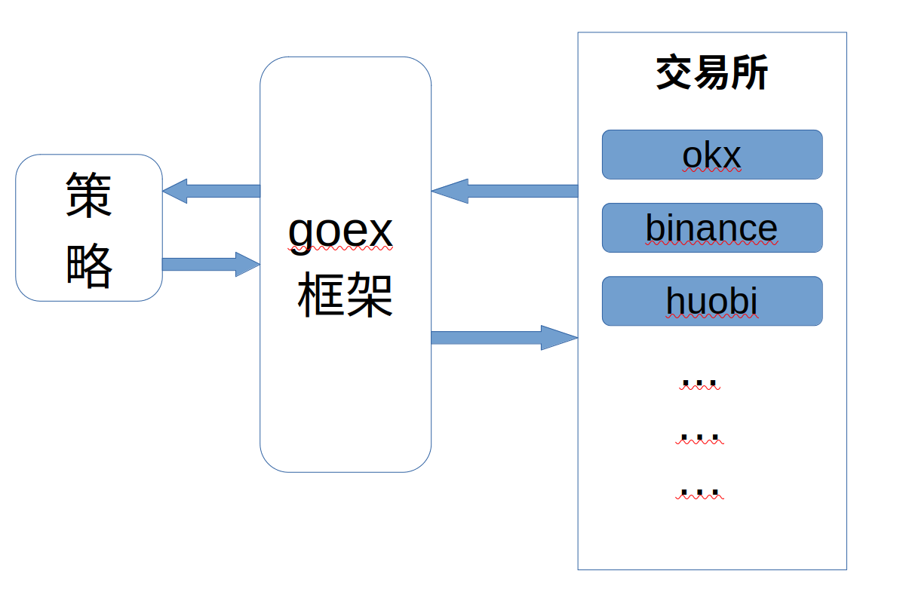

# goex

* 该包用于连接和查询支持的交易所的数据，统一和标准化各种加密货币交易平台的接口。原github仓库地址[gocryptotrader.exchanges](https://github.com/thrasher-corp/gocryptotrader/tree/master/exchanges)


<p>当前支持的交易所 :<br></p>


<div>1.  Alphapoint</div>
<div>2.  Binance</div>
<div>3.  Binance US</div>
<div>4.  Bitfinex</div>
<div>5.  Bithumb</div>
<div>6.  Bitflyer</div>
<div>7.  Bitmex</div>
<div>8.  Bitstamp</div>
<div>9.  Bittrex</div>
<div>10.  Btc Markets</div>
<div>11.  BTSE</div>
<div>12.  Bybit</div>
<div>13.  Coinbase Pro</div>
<div>14.  Coinut</div>
<div>15.  Exmo</div>
<div>16.  Gateio</div>
<div>17.  Gemini</div>
<div>18.  HitBTC</div>
<div>19.  Huobi</div>
<div>20.  Itbit</div>
<div>21.  Kraken</div>
<div>22.  Kucoin</div>
<div>23.  LBank</div>
<div>24.  Okcoin</div>
<div>25.  OKEx</div>
<div>26.  Poloniex</div>
<div>27.  Yobit</div>
<div>28.  Zb</div>


## Features

- REST Support
- Websocket Support


## Import Package

```go
import "github.com/aaabigfish/goex"
```


## 示例

### 如何进行 REST 公/私 函数调用

```go
	var ex goex.Exchange

	ex = binance.NewBinance()

	// 共有函数调用

	// 获取当前股票信息
	tick, err := ex.FetchTicker(context.Background(), currency.NewPair(currency.BTC, currency.USDT), asset.Spot)
	if err != nil {
		// Handle error
	}
	log.PP(tick, err)

	// 获取当前订单信息
	ob, err := ex.FetchOrderbook(context.Background(), currency.NewPair(currency.BTC, currency.USDT), asset.Spot)
	if err != nil {
		// Handle error
	}
	log.PP(ob, err)

	// 私有函数调用

    // 调用之前确保你的 APIKEY 和 APISECRET已经设置（只需要设置一次）
    ex.GetBase().API.SetKey("your_key")
	ex.GetBase().API.SetSecret("your_secret")
	ex.GetBase().API.SetClientID("your_clientid")
	ex.GetBase().API.SetPEMKey("your_PEM_key")
	ex.GetBase().API.SetSubAccount("your_specific_subaccount")

	// 也可以使用如下方式初始化
	// ex.GetBase().SetCredentials(apiKey, apiSecret, "", "", "", "")

	// 获取当前帐户信息
	accountInfo, err := ex.FetchAccountInfo(context.Background(), asset.Spot)
	if err != nil {
		// Handle error
	}
	log.PP(accountInfo)
```


### 如何通过单独导入包启用，示例如下：
- 下面是单独导入币安交易所的示例

```go
    // 包导入
    import "github.com/aaabigfish/goex/binance"

    b := binance.NewBinance()

	// 共有函数调用

	// 获取当前股票信息,使用统一 FetchTicker 函数或者 b.GetTickers(context.Background())
	ticker, err := b.FetchTicker(context.Background(), currency.NewPair(currency.BTC, currency.USDT), asset.Spot)
	if err != nil {
		// Handle error
	}
	fmt.Println(ticker)

	// 私有函数调用

	// 调用之前确保你的 APIKEY 和 APISECRET已经设置（只需要设置一次）
	b.API.SetKey("your_key")
	b.API.SetSecret("your_secret")
	b.API.SetClientID("your_clientid")
	b.API.SetPEMKey("your_PEM_key")
	b.API.SetSubAccount("your_specific_subaccount")
	// 或使用 b.Base.SetCredentials() 初始化

    // 私有API提交订单示例
	o := &order.Submit{
		Exchange:  b.Name, // or method GetName()
		Pair:      currency.NewPair(currency.BTC, currency.USDT),
		Side:      order.Sell,
		Type:      order.Limit,
		Price:     1000000,
		Amount:    0.1,
		AssetType: asset.Spot,
	}

	resp, err := b.SubmitOrder(context.Background(), o)
	if err != nil {
		// Handle error
		fmt.Println(err)
	}
	fmt.Println(resp)
```

### 如何使用 Websocket 公/私

```go

```

## 通用函数接口说明 [Exchange](./interfaces.go)

| 接口名称                        | 函数名                                            | 函数说明                                           |
| --------------------------- | ------------------------------------------ | ---------------------------------- |
| Exchange                    | Setup(exch *config.Exchange) error        | 设置交易所配置                                |
|                            | Start(ctx context.Context, wg *sync.WaitGroup) error | 启动交易所                                       |
|                            | SetDefaults()                                  | 设置默认值                                       |
|                            | Shutdown() error                               | 关闭交易所                                       |
|                            | GetName() string                              | 获取交易所名称                                  |
|                            | SetEnabled(bool)                               | 设置是否启用                                     |
|                            | GetEnabledFeatures() FeaturesEnabled        | 获取已启用功能列表                           |
|                            | GetSupportedFeatures() FeaturesSupported    | 获取支持的功能列表                             |
|                            | FetchTicker(ctx context.Context, p currency.Pair, a asset.Item) (*ticker.Price, error) | 获取Tick价格 |
|                            | UpdateTicker(ctx context.Context, p currency.Pair, a asset.Item) (*ticker.Price, error) | 更新Tick价格 |
|                            | UpdateTickers(ctx context.Context, a asset.Item) error | 更新所有Tick价格                      |
|                            | FetchOrderbook(ctx context.Context, p currency.Pair, a asset.Item) (*orderbook.Base, error) | 获取订单簿  |
|                            | UpdateOrderbook(ctx context.Context, p currency.Pair, a asset.Item) (*orderbook.Base, error) | 更新订单簿  |
|                            | FetchTradablePairs(ctx context.Context, a asset.Item) (currency.Pairs, error) | 获取可交易货币对 |
|                            | UpdateTradablePairs(ctx context.Context, forceUpdate bool) error | 更新可交易货币对 |
|                            | GetEnabledPairs(a asset.Item) (currency.Pairs, error) | 获取启用的货币对 |
|                            | GetAvailablePairs(a asset.Item) (currency.Pairs, error) | 获取可用的货币对 |
|                            | SetPairs(pairs currency.Pairs, a asset.Item, enabled bool) error | 设置货币对          |
|                            | GetAssetTypes(enabled bool) asset.Items | 获取资产类型        |
|                            | GetRecentTrades(ctx context.Context, p currency.Pair, a asset.Item) ([]trade.Data, error) | 获取最近交易 |
|                            | GetHistoricTrades(ctx context.Context, p currency.Pair, a asset.Item, startTime, endTime time.Time) ([]trade.Data, error) | 获取历史交易 |
|                            | GetFeeByType(ctx context.Context, f *FeeBuilder) (float64, error) | 获取费用 |
|                            | GetLastPairsUpdateTime() int64 | 获取最后更新货币对时间 |
|                            | GetWithdrawPermissions() uint32 | 获取提现权限 |
|                            | FormatWithdrawPermissions() string | 格式化提现权限 |
|                            | GetAccountFundingHistory(ctx context.Context) ([]FundingHistory, error) | 获取账户资金历史 |
|                            | GetDepositAddress(ctx context.Context, cryptocurrency currency.Code, accountID, chain string) (*deposit.Address, error) | 获取充值地址 |
|                            | GetAvailableTransferChains(ctx context.Context, cryptocurrency currency.Code) ([]string, error) | 获取可用的链 |
|                            | GetWithdrawalsHistory(ctx context.Context, code currency.Code, a asset.Item) ([]WithdrawalHistory, error) | 获取提现历史 |
|                            | WithdrawCryptocurrencyFunds(ctx context.Context, withdrawRequest *withdraw.Request) (*withdraw.ExchangeResponse, error) | 提现加密货币资金 |
|                            | WithdrawFiatFunds(ctx context.Context, withdrawRequest *withdraw.Request) (*withdraw.ExchangeResponse, error) | 提现法定货币资金 |
|                            | WithdrawFiatFundsToInternationalBank(ctx context.Context, withdrawRequest *withdraw.Request) (*withdraw.ExchangeResponse, error) | 提现法定货币至国际银行 |
|                            | SetHTTPClientUserAgent(ua string) error | 设置HTTP客户端用户代理 |
|                            | GetHTTPClientUserAgent() (string, error) | 获取HTTP客户端用户代理 |
|                            | SetClientProxyAddress(addr string) error | 设置客户端代理地址 |
|                            | GetDefaultConfig(ctx context.Context) (*config.Exchange, error) | 获取默认配置 |
|                            | GetBase() *Base | 获取基础信息 |
|                            | GetHistoricCandles(ctx context.Context, pair currency.Pair, a asset.Item, interval kline.Interval, start, end time.Time) (*kline.Item, error) | 获取历史K线 |
|                            | GetHistoricCandlesExtended(ctx context.Context, pair currency.Pair, a asset.Item, interval kline.Interval, start, end time.Time) (*kline.Item, error) | 获取扩展历史K线 |
|                            | DisableRateLimiter() error | 禁用速率限制器 |
|                            | EnableRateLimiter() error | 启用速率限制器 |
|                            | GetServerTime(ctx context.Context, ai asset.Item) (time.Time, error) | 获取服务器时间 |
|                            | GetWebsocket() (*stream.Websocket, error) | 获取WebSocket |
|                            | SubscribeToWebsocketChannels(channels []stream.ChannelSubscription) error | 订阅WebSocket频道 |
|                            | UnsubscribeToWebsocketChannels(channels []stream.ChannelSubscription) error | 取消订阅WebSocket频道 |
|                            | GetSubscriptions() ([]stream.ChannelSubscription, error) | 获取WebSocket订阅 |
|                            | FlushWebsocketChannels() error | 刷新WebSocket频道 |
|                            | AuthenticateWebsocket(ctx context.Context) error | WebSocket身份验证 |
|                            | GetOrderExecutionLimits(a asset.Item, cp currency.Pair) (order.MinMaxLevel, error) | 获取订单执行限制 |
|                            | CheckOrderExecutionLimits(a asset.Item, cp currency.Pair, price, amount float64, orderType order.Type) error | 检查订单执行限制 |
|                            | UpdateOrderExecutionLimits(ctx context.Context, a asset.Item) error | 更新订单执行限制 |
|                            | GetCredentials(ctx context.Context) (*account.Credentials, error) | 获取凭证 |
|                            | ValidateAPICredentials(ctx context.Context, a asset.Item) error | 验证API凭证 |
|                            | VerifyAPICredentials(creds *account.Credentials) error | 验证API凭证 |
|                            | GetDefaultCredentials() *account.Credentials | 获取默认API凭证 |
| OrderManagement             | SubmitOrder(ctx context.Context, s *order.Submit) (*order.SubmitResponse, error) | 提交订单 |
|                            | ModifyOrder(ctx context.Context, action *order.Modify) (*order.ModifyResponse, error) | 修改订单 |
|                            | CancelOrder(ctx context.Context, o *order.Cancel) error | 取消订单 |
|                            | CancelBatchOrders(ctx context.Context, o []order.Cancel) (*order.CancelBatchResponse, error) | 取消批量订单 |
|                            | CancelAllOrders(ctx context.Context, orders *order.Cancel) (order.CancelAllResponse, error) | 取消所有订单 |
|                            | GetOrderInfo(ctx context.Context, orderID string, pair currency.Pair, assetType asset.Item) (*order.Detail, error) | 获取订单信息 |
|                            | GetActiveOrders(ctx context.Context, getOrdersRequest *order.MultiOrderRequest) (order.FilteredOrders, error) | 获取活跃订单 |
|                            | GetOrderHistory(ctx context.Context, getOrdersRequest *order.MultiOrderRequest) (order.FilteredOrders, error) | 获取订单历史 |
| CurrencyStateManagement     | GetCurrencyStateSnapshot() ([]currencystate.Snapshot, error) | 获取货币状态快照 |
|                            | UpdateCurrencyStates(ctx context.Context, a asset.Item) error | 更新货币状态 |
|                            | CanTradePair(p currency.Pair, a asset.Item) error | 是否可以交易货币对 |
|                            | CanTrade(c currency.Code, a asset.Item) error | 是否可以交易 |
|                            | CanWithdraw(c currency.Code, a asset.Item) error | 是否可以提现 |
|                            | CanDeposit(c currency.Code, a asset.Item) error | 是否可以充值 |
| AccountManagement           | UpdateAccountInfo(ctx context.Context, a asset.Item) (account.Holdings, error) | 更新账户信息 |
|                            | FetchAccountInfo(ctx context.Context, a asset.Item) (account.Holdings, error) | 获取账户信息 |
|                            | HasAssetTypeAccountSegregation() bool | 是否支持资产类型账户隔离 |
| FunctionalityChecker        | IsEnabled() bool | 是否启用 |
|                            | IsAssetWebsocketSupported(a asset.Item) bool | WebSocket是否支持资产类型 |
|                            | SupportsAsset(assetType asset.Item) bool | 是否支持资产类型 |
|                            | SupportsREST() bool | 是否支持REST API |
|                            | SupportsWithdrawPermissions(permissions uint32) bool | 是否支持提现权限 |
|                            | SupportsRESTTickerBatchUpdates() bool | 是否支持REST Tick批量更新 |
|                            | IsWebsocketEnabled() bool | 是否启用WebSocket |
|                            | SupportsWebsocket() bool | 是否支持WebSocket |
|                            | SupportsAutoPairUpdates() bool | 是否支持自动货币对更新 |
|                            | IsWebsocketAuthenticationSupported() bool | 是否支持WebSocket身份验证 |
|                            | IsRESTAuthenticationSupported() bool | 是否支持REST API身份验证 |
| FuturesManagement           | ScaleCollateral(ctx context.Context, calculator *futures.CollateralCalculator) (*collateral.ByCurrency, error) | 比例保证金 |
|                            | GetPositionSummary(context.Context, *futures.PositionSummaryRequest) (*futures.PositionSummary, error) | 获取持仓摘要 |
|                            | CalculateTotalCollateral(context.Context, *futures.TotalCollateralCalculator) (*futures.TotalCollateralResponse, error) | 计算总保证金 |
|                            | GetFundingRates(context.Context, *fundingrate.RatesRequest) (*fundingrate.Rates, error) | 获取资金费率 |
|                            | GetLatestFundingRate(context.Context, *fundingrate.LatestRateRequest) (*fundingrate.LatestRateResponse, error) | 获取最新资金费率 |
|                            | IsPerpetualFutureCurrency(asset.Item, currency.Pair) (bool, error) | 是否是永续合约货币对 |
|                            | GetCollateralCurrencyForContract(asset.Item, currency.Pair) (currency.Code, asset.Item, error) | 获取合约保证金货币 |
|                            | GetFuturesPositionSummary(context.Context, *futures.PositionSummaryRequest) (*futures.PositionSummary, error) | 获取期货持仓摘要 |
|                            | GetFuturesPositionOrders(context.Context, *futures.PositionsRequest) ([]futures.PositionResponse, error) | 获取期货持仓订单 |
|                            | SetCollateralMode(ctx context.Context, item asset.Item, mode collateral.Mode) error | 设置保证金模式 |
|                            | GetCollateralMode(ctx context.Context, item asset.Item) (collateral.Mode, error) | 获取保证金模式 |
|                            | SetLeverage(ctx context.Context, item asset.Item, pair currency.Pair, marginType margin.Type, amount float64, orderSide order.Side) error | 设置杠杆 |
|                            | GetLeverage(ctx context.Context, item asset.Item, pair currency.Pair, marginType margin.Type, orderSide order.Side) (float64, error) | 获取杠杆 |
| MarginManagement            | SetMarginType(ctx context.Context, item asset.Item, pair currency.Pair, tp margin.Type) error | 设置保证金类型 |
|                            | ChangePositionMargin(ctx context.Context, change *margin.PositionChangeRequest) (*margin.PositionChangeResponse, error) | 更改仓位保证金 |
|                            | GetMarginRatesHistory(context.Context, *margin.RateHistoryRequest) (*margin.RateHistoryResponse, error) | 获取保证金费率历史 |
|                            | futures.PNLCalculation | 期货盈亏计算 |
|                            | GetFuturesContractDetails(ctx context.Context, item asset.Item) ([]futures.Contract, error) | 获取期货合约详情 |


## 添加新交易所指南

+ 可以找到有关为新交易所实施 API 支持的指南[这里](./docs/ADD_NEW_EXCHANGE.md)